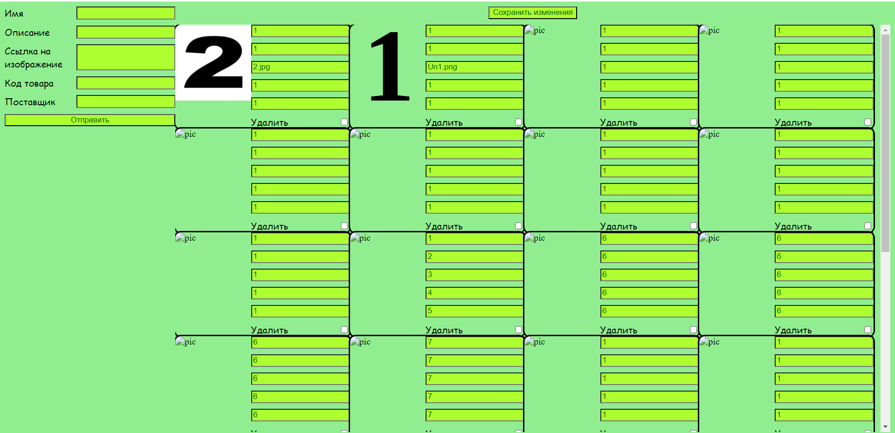
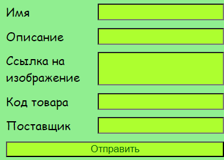
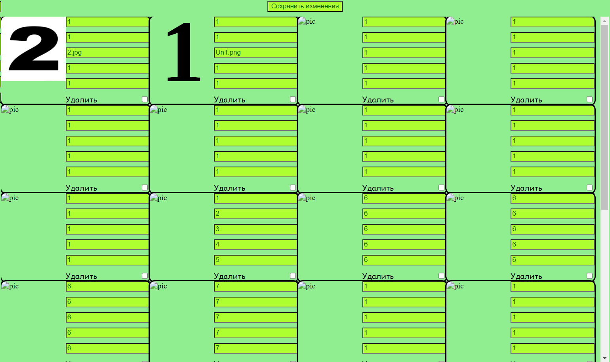

Перед запуском нужно из папки с 'db.json' нужно запустить 'json-server --watch db.json', чтобы запустить сервер.
Экран предзагрузги и загрузки разные просто потому-что, в остальном просто заменил работу с LocaleStorage на работу с сервером.
И так при запуске страницы со скриптом вы увидете примерно такую картину:

Слева вы увидите поле заполнения карты, оно сделано через форму, поля для заполнения необходимы:

Справа же показывается сам список карточек, картинка карты слева от поли с её описанием, 
редактировать карту можно сразу в полях описания, для сохранения изменений нужно нажать соответствующую кнопку над списком:

